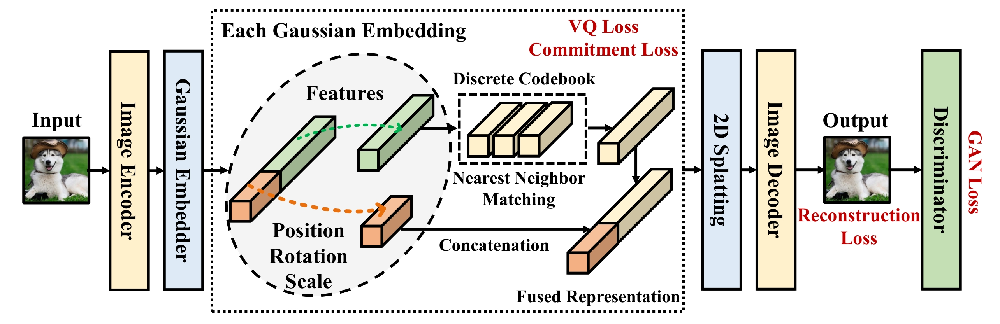

# GaussianToken: An Effective Image Tokenizer with 2D Gaussian Splatting

<div>

[](https://arxiv.org/abs/2301.13430)


</div>



# Dataset
1. Prepare the datasets as the following structures.
    - CIFAR-100:
        ```bash
        <path-to-dataset>/cifar-100-python/
        ├── file.txt~
        ├── meta
        ├── test
        └── train
        ```
    - Mini-ImageNet:
        ```bash
        <path-to-dataset>/mini-imagenet/
        ├── images
        ├── test.csv
        ├── train.csv
        └── val.csv
        ```
    - ImageNet:
        ```bash
        <path-to-dataset>/imagenet
        ├── ImageNet_class_index.json
        ├── ImageNet_val_label.txt
        ├── train
        └── val

        <path-to-dataset>/imagenet/train/
        ├── n01440764
        │   ├── n01440764_10026.JPEG
        │   ├── n01440764_10027.JPEG
        │   ├── ...
        ├── n01443537
        │   ├── n01443537_10007.JPEG
        │   ├── n01443537_10014.JPEG
        │   ├── ...
        ├── ...
        ```

2. Write the following environment variables into file `.bashrc`.
   ```bash
   # dataset env
   export DATASET_ROOT="<path-to-dataset>"
   export MINI_IMAGENET_ROOT="${DATASET_ROOT}/mini-imagenet"
   export CIFAR100_ROOT="${DATASET_ROOT}"
   export IMAGENET_ROOT="${DATASET_ROOT}/imagenet"
   ```

# Installation
1. Create a conda environment.
   ```bash
   conda create -n gstk python=3.9.13
   conda activate gstk
   ```
2. Install the dependent packages.
   ```bash
   pip install -r requirements.txt
   pip install -r requirements-extra.txt
   ```
3. Install gsplat & deformable attn modules.
   ```bash
   cd gstk/modules/gsplat && python setup.py build install
   cd ../gaussianembed/ops && python setup.py build install
   ```

> **Note**: Please first modify `requirements-extra.txt` for appropriate Pytorch version according to the CUDA (default is v12.1). 

# Training
1. Change the script permissions.
    ```bash
    chmod +x ./scripts/*
    ```
2. Running script:
    - CIFAR:
        ```bash
        ./scripts/cifar-gqgan-1.sh
        ```
    - Mini-ImageNet:
        ```bash
        ./scripts/mini-gqgan-1.sh
        ```
    - ImageNet:
        ```bash
        ./scripts/in-gqgan-1.sh
        ```
    The training log files will be saved in the `./logs` folder.

# Evaluating
- Image reconstruction.
    ```bash
    ./scripts/rec-1.sh
    ```
- Metrics calculation
    ```bash
    ./scripts/val-1.sh
    ```

# Pretrained Models
The pre-trained weights will be released soon.

# Acknowledgments
- [Deformable DETR](https://github.com/fundamentalvision/Deformable-DETR)
- [GaussianImage](https://github.com/Xinjie-Q/GaussianImage)
- [vector-quantize-pytorch](https://github.com/lucidrains/vector-quantize-pytorch)
- [GaussianFormer](https://github.com/huang-yh/GaussianFormer)
- [taming-transformers](https://github.com/CompVis/taming-transformers)
- [Open-MAGVIT2](https://github.com/TencentARC/SEED-Voken)
